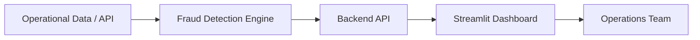

# 🚨🚨🚨 Anti-Fraud Intelligence Platform 🚨🚨🚨

##  Executive Summary

This project is a **data-driven anti-fraud intelligence system** designed to monitor, detect, and analyze operational anomalies in real time. It combines **streaming analytics, rule-based detection, and interactive visualization** to support operational teams in identifying suspicious behaviors during mission execution.

The system bridges the gap between **raw operational data and decision-making**, enabling faster response times and increased reliability of field operations.

---

##  Problem Statement

Operational workflows exhibited critical challenges:

*  Fraudulent mission executions (fake check-ins, incomplete journeys)
*  Lack of real-time visibility
*  Data fragmentation across systems
*  High manual analysis cost

These issues compromised:

* Data integrity
* Operational efficiency
* Decision-making accuracy

---

##  Solution Overview

A modular anti-fraud system composed of:

* **Data ingestion layer**
* **Fraud detection engine**
* **API layer**
* **Interactive dashboard**

Enabling:

* Real-time anomaly detection
* Behavioral analysis
* Operational monitoring

---

##  System Architecture



---

## ⚙️ Core Components

### 1. Fraud Detection Engine

* Rule-based anomaly detection
* Behavioral pattern analysis
* Data validation and consistency checks

---

### 2. Backend API

* Data processing and serving
* Business rule execution
* Integration layer between data and UI

---

### 3. Dashboard (Streamlit + Plotly)

* Real-time monitoring
* Interactive visualizations
* Operational insights

---

##  Fraud Detection Logic

Examples of implemented rules:

*  Execution time below expected threshold
*  Missing or inconsistent interaction points
*  Abnormal mission patterns
*  Incomplete customer journey

---

## 📊 Data Model

The system operates on structured mission-level data:

```json
{
  "mission_id": "MB",
  "user_id": "MU",
  "checkin": "timestamp",
  "checkout": "timestamp",
  "status": "string",
  "duration": "numeric",
  "flags": ["anomaly_type"]
}
```

---

## 🚀 Getting Started

### 1. Run the API

```bash
uvicorn main:app --reload
```

### 2. Run the Dashboard

```bash
streamlit run dashboard.py
```

### 3. Access

```
http://localhost:8501
```

---

##  Project Structure

```
antifraude_windows/
│
├── dashboard.py        # Streamlit UI
├── main.py             # API entry point
├── models/             # Fraud logic
├── utils/              # Helpers
├── data/               # Data sources
└── requirements.txt
```

---

## 📈 Key Capabilities

*  Near real-time monitoring
*  Fraud detection at scale
*  Interactive analytics
*  Data-driven decision support

---

## Future Improvements

* Integration with **Supabase (Data Warehouse)**
* Real-time streaming (Kafka / Webhooks)
* Machine Learning-based anomaly detection
* Alerting system (Slack / WhatsApp)

---

## Business Impact

* Reduced fraud occurrence
* Increased operational transparency
* Faster decision cycles
* Improved data reliability

---

## Design Principles

* Data as a product
* Observability-first approach
* Modular and scalable architecture
* Real-time over batch where possible


This project is part of a broader initiative to transform operational workflows into **intelligent, data-driven systems**.
